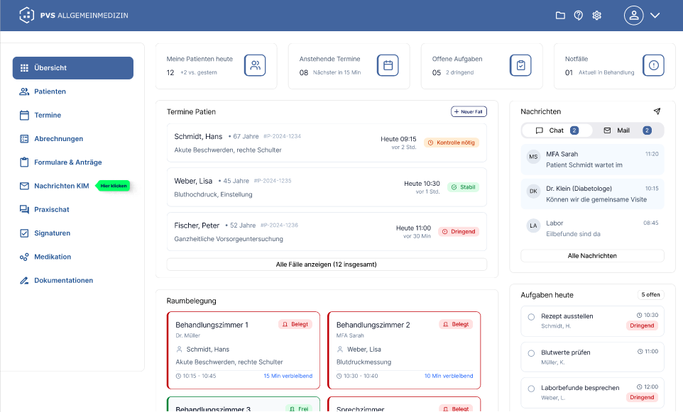

= Best Practices – Suche im FHIR-VZD
:toc: left
:toclevels: 3
:sectnums:
:sectnumlevels: 3
:icons: font
:source-highlighter: rouge
:experimental:
:imagesdir: .

[cols="1,3"]
|===
| Version | 2.0.0-Entwurf
| Stand   | 01.09.2026
| Status  | in Bearbeitung
| Author  | gematik 
|===

== Einordnung des Dokuments

=== Kontext und Zielsetzung

Bei der Suche im Verzeichnisdienst (VZD) treten derzeit verschiedene Herausforderungen auf. Suchende innerhalb eines Primärsystems finden häufig nicht die passenden Einträge, was zu zeitaufwendigen Recherchen und ineffizienten Arbeitsabläufen führt. Besonders im Gesundheitswesen, wo ohnehin wenig Zeit zur Verfügung steht, erhöhen solche Verzögerungen den Arbeitsdruck zusätzlich.

Die Digitalisierung soll Prozesse für Leistungserbringer vereinfachen, beschleunigen und entlasten, nicht zusätzliche Belastungen mit sich bringen. Die aktuellen Herausforderungen mit der VZD-Suche innerhalb von Anwendungen stehen diesem Anspruch entgegen und machen Optimierungen dringend erforderlich.

Zugleich hängt die tatsächliche Funktionalität der Suche maßgeblich von der Implementierung durch die Hersteller ab, wie Umfragen deutlich gezeigt haben.

Daher beschreibt dieses Dokument Best Practices und Implementierungstipps für Hersteller, um eine effiziente und nutzerfreundliche VZD-Suche sicherzustellen.

Mit dieser Anpassung der Suche in Primärsystemen erfolgt gleichzeitig die notwendige Umstellung der Suchfunktionalitäten auf den FHIR-basierten Verzeichnisdienst (FHIR-VZD). Die hierin beschriebenen Best Practices und Implementierungsempfehlungen sollen Hersteller dabei unterstützen, diese Migration erfolgreich umzusetzen und die erweiterten Möglichkeiten des FHIR-VZD für eine leistungsfähige, nutzerfreundliche und standardkonforme Suche optimal zu nutzen. Das Dokument dient damit sowohl als Orientierung für die fachliche und technische Optimierung der Suche als auch als Leitfaden für die Umstellung auf die neue VZD-Technologie.

Ziel dieses Dokuments ist es:

* Migration von der VZD LDAP Suche auf den neuen FHIR-VZD
* eine benutzerfreundliche und intuitive Suche (User Experience) zu ermöglichen, die den Aufwand für Suchende reduziert,
* hohe Trefferqualität im Primärsystem zu erreichen, damit Nutzende schnell und zuverlässig die richtigen Einträge finden,
* die Darstellung der Suchergebnisse zu optimieren, um Nutzenden durch gezielte Filterung oder Sortierung eine nachgelagerte Eingrenzung zu ermöglichen,
* technische Robustheit und Performance durch effiziente Anfragegestaltung und ressourcenschonende Suchstrategien zu verbessern, um Systemstabilität und Antwortzeiten auf hohem Niveau zu halten.

=== Zielgruppe

Die Zielgruppe dieses Dokuments sind Hersteller von Anwendungen, die eine Suchfunktion des VZD in ihren Anwendungen implementieren.

Dazu gehören Hersteller von Praxissoftware (AVS, PVS, KIS)

*Empfohlene Lesepfade nach Rolle*

[width="100%",cols="57%,43%",options="header",]
|===
|Rolle |Empfohlener Einstieg
|Produktmanagement / UX |Kapitel 1, 3, 10, 11, 12
|Entwicklung Client / Backend |Kapitel 2, 4, 5, 6, 7, 8, 9
|Test / Abnahme |Kapitel 4.6, 7, 8, 12
|===

=== Abgrenzung zu anderen Dokumenten

[NOTE]
====
*Hinweis:* Dieses Dokument ist eine *Ergänzung*, kein Ersatz für die normativen Dokumente der gematik.
====

[width="100%",cols="44%,33%,23%",options="header",]
|===
|Dokument |Inhalt |Verhältnis zu diesem Dokument
|`gemSpec_VZD_FHIR_Directory` |Normative Spezifikation des Dienstes (Anforderungen an Hersteller und Anbieter des VZD) |Verbindlich. Dieses Dokument macht keine abweichenden Vorgaben.
|`gemILF_VZD_FHIR_Directory` |Implementierungsleitfaden für Clients |Verbindliche Grundlage für die Anbindung.
|`FHIR_VZD_HOWTO_Search.adoc` |Technische Referenz der Suchschnittstelle inkl. Beispielrequests |*Primäre technische Quelle.* Dieses Dokument verweist darauf und ergänzt Empfehlungen zur Anwendung.
|`FHIR_VZD_HOWTO_Authenticate.adoc` |Beschaffung von `searchaccess_token` bzw. Token für `/fdv/search` |Voraussetzung für alle hier gezeigten Beispiele.
|Datenmodell auf Simplifier (`vzd-fhir-directory`) |Profile, CodeSystems, ValueSets |Referenz für alle Codes und Attribute.
|Dieses Dokument |Best Practices, Anti-Pattern, UX- und Performance-Empfehlungen |*Unverbindlich*, praxisorientiert.
|===

=== Methodik

Die Erkenntnisse in diesem Dokument stützen sich auf eine Kombination verschiedener Informationsquellen:

* Interviews mit Anwenderinnen und Anwendern, die regelmäßig mit der VZD-Suche arbeiten
* Hospitationen in realen Nutzungssituationen, um Arbeitsabläufe, Herausforderungen und Suchverhalten direkt zu beobachten
* Nutzererfahrungen aus den Modellregionen, die Einblicke in den praktischen Einsatz unter Alltagsbedingungen liefern
* Auswertung der technischen Dokumentation des FHIR-VZD sowie beobachtetes Laufzeitverhalten der Suchschnittstellen

=== Hinweis zur Weiterentwicklung und Verbindlichkeit der Empfehlungen

Die hier beschriebenen Implementierungstipps basieren auf dem aktuellen Entwicklungsstand des FHIR-VZD und den bisher gewonnenen Erfahrungswerten. Da der Verzeichnisdienst kontinuierlich weiterentwickelt wird, können sich einzelne Empfehlungen im Laufe der Zeit ändern oder an neue technische Rahmenbedingungen anpassen.

Die beschriebenen Best Practices stellen keine verpflichtenden Vorgaben, sondern unverbindliche, praxisorientierte Empfehlungen dar, die Herstellern helfen sollen, eine robuste und benutzerfreundliche Suchfunktion zu realisieren.

Wir freuen uns über Feedback, Verbesserungsvorschläge und Praxiserfahrungen, um diese Hinweise gemeinsam weiterzuentwickeln und laufend zu optimieren.

[TIP]
====
*Versionsbezug:* Verhalten der Volltextsuche (z. B. Behandlung von Sonderzeichen) ist releaseabhängig. Empfehlung: In der eigenen Anwendung die getestete VZD-FHIR-Version dokumentieren und Release Notes des Dienstes abonnieren.
====

=== Begriffe und Abkürzungen

[width="100%",cols="22%,78%",options="header",]
|===
|Begriff |Bedeutung
|LE |Leistungserbringende (natürliche Person), im FHIR-VZD abgebildet über `Practitioner` / `PractitionerRole`
|LEI |Leistungserbringerinstitution (Organisation), abgebildet über `Organization` / `HealthcareService`
|Telematik-ID |Eindeutige Kennung eines Eintrags, z. B. `1-200-876000052`
|Endpoint |FHIR-Ressource, die eine Kommunikationsadresse trägt (z. B. KIM-Adresse, TI-M-Adresse)
|`_text` |Volltext-Suchparameter über die indexierten Attribute der verknüpften Ressourcen
|`/fdv/search` |Suchschnittstelle für Versichertenfrontends (FdV) sowie für Nutzung durch Primärsysteme
|Fuzzy-Suche |Unscharfe Suche auf Basis der Levenshtein-Distanz (`~`)
|===

=== Click-Dummy

https://www.figma.com/proto/PnMNeqXL0LeZ3PCjusuY3f/VZD-im-PVS?node-id=1011-8632&p=f&viewport=-2108%2C-612%2C0.1&t=Jnqa55IjrXhXcaRW-1&scaling=scale-down&content-scaling=fixed&starting-point-node-id=1011%3A8632&page-id=0%3A1[Click-Dummy Live-Preview (Figma)]

== Grundlagen der Suche im FHIR-VZD

=== Schnittstellen im Überblick

[width="100%",cols="21%,49%,30%",options="header",]
|===
|Schnittstelle |Zweck |Typische Nutzer
|`/search` |Suche nach Organisationen und Personen für TI-Anwendungen |TI-Messenger
|`/fdv/search` |Suche für Frontends des Versicherten, inkl. optimierter Umkreis-Operationen |ePA-App, E-Rezept-App, PVS, AVS, KIS,
|`/kim/search` |In Definition, geplant für VZD FHIR 1.2.0-18 |
|`/owner` |Pflege eigener Einträge (Servicedaten) |AVS, Self-Service-Portal
|===

*Umgebungen*

[width="100%",cols="14%,86%",options="header",]
|===
|Umgebung |Basis-URL
|TU |`https://fhir-directory-tu.vzd.ti-dienste.de`
|RU |`https://fhir-directory-ref.vzd.ti-dienste.de`
|PU |`https://fhir-directory.vzd.ti-dienste.de`
|===

=== Datenmodell in Kürze

Für die Suche sind zwei Einstiegsressourcen relevant:

[width="100%",cols="30%,24%,46%",options="header",]
|===
|Suchziel |Einstiegsressource |Verknüpfte Ressourcen (über `_include`)
|Institution (LEI) |`HealthcareService` |`Organization`, `Location`, `Endpoint`
|Person (LE) |`PractitionerRole` |`Practitioner`, `Location`, `Endpoint`
|Kommunikationsadresse |`Endpoint` |über `_revinclude` / `_has` auflösbar
|===

[IMPORTANT]
====
Die fachliche Unterscheidung *LEI vs. LE* in der Benutzeroberfläche entspricht direkt der technischen Unterscheidung *HealthcareService vs. PractitionerRole*. Wer beide Ressourcentypen in einer gemeinsamen Trefferliste mischt, muss die Herkunft eines Treffers im Datenmodell mitführen, sonst sind Filter und Symbole in der UI nicht zuverlässig ableitbar (siehe Kapitel 7.2).
====

=== Authentifizierung und Token-Handling

Für jeden Suchaufruf wird ein gültiges Access-Token benötigt (`searchaccess_token` für `/search`).

==== Wiederverwendung von Token

* Token *zentral* verwalten und über alle Suchanfragen hinweg wiederverwenden – nicht pro Tastendruck neu anfordern.
* Ablaufzeit auswerten und proaktiv erneuern (z. B. bei Restlaufzeit < 20 %), statt auf HTTP 401 zu warten.
* Genau *einen* Retry nach Token-Erneuerung bei HTTP 401; danach mit verständlicher Meldung abbrechen.
* Token niemals im Log, in URL-Parametern oder in Crash-Reports ausgeben.

*Beispiel: Ablaufsteuerung (Pseudocode)*

[source,text]
----
if (token == null || token.expiresInSeconds() < 60) {
    token = authService.fetchSearchAccessToken();   // siehe HOWTO_Authenticate
}
response = http.get(searchUrl, bearer(token));
if (response.status == 401) {
    token = authService.fetchSearchAccessToken();   // genau ein Retry
    response = http.get(searchUrl, bearer(token));
}
----

=== Die vier Zugriffswege im Überblick

[width="100%",cols="37%,35%,28%",options="header",]
|===
|Zugriffsweg |Wofür geeignet |Wofür ungeeignet
|Volltextsuche (`_text`) |Freitexteingabe durch Nutzenden: Name, Ort, Straße, PLZ, Telematik-ID, Fachrichtung, ... |Attribute, die nicht indexiert sind (siehe Kapitel 4.1)
|Parameterbasierte Suche |Konzeptierte Filter: Fachgruppe, Ort, Endpoint-Typ, Organisationstyp |Ungenaue Freitextsuchen z.B. mit Teilstrings und Werten ohne klaren Attributs-Bezug
|FHIR-Operationen (`_query=near`, `_query=nearPharmacy`) |Umkreissuche mit Sortierung nach Entfernung |Suche ohne Geokoordinaten
|Direktzugriff über `[id]` |Nachladen einer bekannten Ressource (z. B. Endpoint aus einer Referenz) |Suche; zudem *ohne* serverseitige Aktiv-Prüfung
|===

=== Grundregel: nur aktive Ressourcen verwenden

An `/search` und `/fdv/search` dürfen nur Ergebnisse verwendet werden, für die gilt:

* `organization.active=true` bzw. `practitioner.active=true` – gilt für *alle* verknüpften Ressourcen der jeweiligen Kette
* `endpoint.status=active` – Endpunkte dürfen nur bei Status „active“ genutzt werden

*Minimalvarianten der Suche*

[source,http]
----
GET [baseUrl]/search/HealthcareService?organization.active=true
GET [baseUrl]/search/PractitionerRole?practitioner.active=true
GET [baseUrl]/search/Endpoint?status=active
GET [baseUrl]/fdv/search/HealthcareService?organization.active=true
GET [baseUrl]/fdv/search/PractitionerRole?practitioner.active=true
GET [baseUrl]/fdv/search/Endpoint?status=active
----

[WARNING]
====
Der Parameter `endpoint.status=active` filtert die *Trefferauswahl*, nicht den Inhalt von `_include`. Über `_include=HealthcareService:endpoint` können weiterhin Endpunkte mit anderem Status im Bundle enthalten sein. *Die Prüfung muss zusätzlich clientseitig erfolgen.*

Beim Direktzugriff über `[id]` erfolgt *keinerlei* Aktiv-Prüfung durch den Dienst – auch nicht für die referenzierenden Ressourcen.
====

== Suchstrategie und Entscheidungshilfe

[NOTE]
====
*Neues Kapitel.* Es beantwortet die in Interviews am häufigsten gestellte Frage: „Welche Suche nehme ich wann?“ Beispielhafte Ausgestaltung – die Schwellenwerte sind Vorschläge.
====

=== Entscheidungshilfe

[width="100%",cols="27%,34%,39%",options="header",]
|===
|Nutzereingabe |Empfohlener Aufruf |Begründung
|Freitext (`Mustermann Berlin`) |`_text` auf `HealthcareService` bzw. `PractitionerRole` |Beste Performance durch eine Indizierung relevanter Felder aus den Haupt- und Subressourcen
|Freitext + strukturierter Filter (Fachgruppe) |`_text` kombiniert mit FHIR-Suchparametern |Attribute außerhalb des Index sind nur parameterbasiert erreichbar
|Telematik-ID / BSNR |`_text="<TID>"` (in Anführungszeichen) |Enthaltene Bindestriche würden sonst als NOT-Operator interpretiert
|„Apotheke in meiner Nähe“ |`_query=nearPharmacy` auf `/fdv/search` |Liefert nach Entfernung sortiert, inkl. Öffnungszeitenfilter
|„Praxen im Umkreis“ |`_query=near` auf `/fdv/search` |Wie oben, für beliebige Organisationstypen
|Bekannte Ressourcen-ID |`GET [base]/[type]/[id]` |Kein Suchlauf nötig – aber clientseitige Aktiv-Prüfung erforderlich
|===

=== Clientseitige Aufbereitung der Eingabe

Ein großer Teil der berichteten Fehltreffer entsteht *vor* dem Request. Empfohlene Verarbeitungskette:

[arabic]
. *Trimmen* und Mehrfach-Leerzeichen reduzieren
. *Normalisieren* fachlicher Schreibvarianten: `Straße`, `Strasse`, `Str.` -> `Str`
. *Sonderzeichen behandeln*: erkennen, ob die Eingabe eine Telematik-ID, PLZ oder E-Mail-artige Adresse ist, und diese in Anführungszeichen setzen
. *Tokenisieren* an Leerzeichen und Komma; Tokens mit `+` (AND) verbinden
. *Mindestlänge prüfen* (3 Zeichen)
. *Entprellen* der Eingabe (Vorschlag: 300 ms Debounce), damit nicht pro Tastendruck ein Request entsteht

*Beispiel einer Normalisierung*

[source,http]
----
Eingabe:     "Dr. Müller, Hauptstraße 12, 10115 Berlin"
Normalisiert: Müller Hauptstr 12 10115 Berlin
Request:     _text=Müller Hauptstr 12 10115 Berlin
----

[TIP]
====
Das Komma aus der Nutzereingabe *muss* entfernt oder ersetzt werden. In der komplexen Volltextsuche wirkt es als OR-Operator – auch innerhalb von Anführungszeichen (siehe Kapitel 4.5).
====

=== Stufenmodell für Suchanfragen

Statt einer einzelnen „perfekten“ Anfrage empfiehlt sich eine Eskalation in Stufen, die der Anwendung angezeigt wird:

[width="100%",cols="24%,37%,39%",options="header",]
|===
|Stufe |Anfrage |Auslöser für die nächste Stufe
|1 – Präzise |Alle Tokens mit AND verknüpft |0 Treffer
|2– Unscharf |Fuzzy-Suche mit `~` auf dem Namensbestandteil |Ergebnis anzeigen, mit Hinweis „ähnliche Schreibweisen“
|3– Eingrenzung |Bei > 100 Treffern: Vorschläge zur Präzisierung anzeigen |–
|===

[WARNING]
====
Die Fuzzy-Suche darf *nicht* der Standardfall sein: Sie erzeugt viele, teils irrelevante Treffer und belastet den Dienst. Einsatz nur, wenn die Schreibweise unbekannt ist oder Stufe 1 und 2 leer geblieben sind.
====

== Volltextsuche im Detail

[NOTE]
====
*Neues Kapitel.* Kernstück der technischen Ergänzung. Die Beispiele sind an die gematik-Dokumentation angelehnt und sollten gegen die aktuelle VZD-FHIR-Version nachgetestet werden.
====

=== Was im Volltext durchsucht wird

Die Werte der verknüpften Ressourcen werden beim Indexieren in das `_text`-Feld der Hauptressource geschrieben. Deshalb ist eine Volltextsuche deutlich performanter als eine Suche über Attribute verknüpfter Ressourcen.

*Indexierte Inhalte für Institutionen (Suche über* `HealthcareService`*)*

[width="100%",cols="38%,62%",options="header",]
|===
|Ressource |Inhalt
|`Organization` |Name; Typ (Bezeichnung und Code) der Institution
|`HealthcareService` |Bezeichnung des Dienstes; Fachrichtung(en); Organisationstyp, Spezialisierungen
|`Location` |Straße mit Hausnummer, Ort, Postleitzahl
|`Organization` / `HealthcareService` |Telematik-ID und Domain-IDs (Telematik-ID, BSNR, IKNR)
|===

*Indexierte Inhalte für Personen (Suche über* `PractitionerRole`*)*

[width="100%",cols="27%,73%",options="header",]
|===
|Ressource |Inhalt
|`Practitioner` |Name; Berufsgruppe bzw. Fachrichtung, Qualifikation; Telematik-ID
|`Location` |Straße mit Hausnummer, Ort, Postleitzahl
|===

[IMPORTANT]
====
*Konsequenz für die UI:* Alles, was nicht in diesen Tabellen steht, ist über die Volltextsuche *nicht* auffindbar. Ein Info-Icon an der Suchleiste sollte genau diese Attribute benennen (siehe Checkliste, Kapitel 12).

Beispiel: Eine LANR ist im FHIR-VZD nicht enthalten und daher weder als Filter noch im Volltext sinnvoll anzubieten.
====

=== Verhalten beim Indexieren

Zwei Effekte führen regelmäßig zu unerwartet leeren Trefferlisten:

[width="100%",cols="26%,36%,38%",options="header",]
|===
|Zeichen |Verhalten beim Indexieren |Auswirkung
|Punkt am Wortende (`Dr.`, `Str.`) |Der Punkt wird entfernt, da er als Satzende interpretiert wird |Indexiert ist `Str`, nicht `Str.` – deshalb clientseitig normalisieren
|Schrägstrich (`Arzt/Ärztin`) |Der Wert wird in zwei Tokens zerlegt (`Arzt`, `Ärztin`) |Die Zeichenkette `Arzt/Ärztin` ist als Ganzes nicht auffindbar
|===

=== Einfache und komplexe Volltextsuche

[width="100%",cols="18%,28%,54%",options="header",]
|===
|Modus |Aktivierung |Verhalten
|Einfach (Standard) |kein zusätzlicher Parameter |Sonderzeichen werden weitgehend ignoriert; in VZD FHIR 1.2.0-11 werden `-` und `,` durch Leerzeichen ersetzt
|Komplex |`_complexSearch=true` |Es gelten die HAPI-FHIR-Regeln inkl. Operatoren (siehe unten)
|===

[TIP]
====
*Empfehlung:* Für die typische Freitextsuche im Primärsystem ist der einfache Modus die richtige Wahl. `_complexSearch=true` nur einsetzen, wenn die Anwendung Operatoren tatsächlich benötigt – und dann die Eingabe vollständig selbst aufbereiten.
====

=== Operatoren der komplexen Volltextsuche

[width="100%",cols="13%,31%,56%",options="header",]
|===
|Operator |Schreibweise |Bedeutung
|AND |`+` oder Leerzeichen |Alle Begriffe müssen enthalten sein
|OR |`,` oder das Pipe-Zeichen (URL-kodiert `%7C`) |Mindestens ein Begriff muss enthalten sein
|NOT |führendes `-` |Begriff darf nicht enthalten sein
|Exakt |`"…"` |Nur exakte Übereinstimmung; Sonderzeichen werden überwiegend literal behandelt
|Fuzzy |`~` |Nur bei Volltextsuche: Unscharfe Suche über die Levenshtein-Distanz
|Teilstring |Modifier `:contains` |Präzisere Treffer bei mehrteiligen Phrasen
|===

*Beispiele*

[source,http]
----
# AND – beide Begriffe müssen vorkommen
_text=Berlin+"Kardiologie"

# OR – mindestens eine Telematik-ID
_text="1-2arvtst-ap104233","1-2arvtst-ap051582"

# NOT – Niedersachsen ohne Hannover
_text=Niedersachsen -Hannover

# Fuzzy – findet auch Coppenbrügge / Coppenbrüge
_text=Coppenbruegge~
----

[NOTE]
====
Der OR-Operator verschlechtert die Suchperformance spürbar und sollte vermieden werden, wo eine AND-Verknüpfung fachlich ausreicht.
====

=== Sonderzeichen: typische Fallen

[WARNING]
====
*Komma:* In der komplexen Volltextsuche wirkt `,` als OR-Operator – auch innerhalb von Anführungszeichen. Eine Adresseingabe `"Musterweg 10, 10178, Berlin"` liefert daher deutlich mehr Treffer als erwartet.

*Backslash-Escaping wird vom FHIR-VZD nicht unterstützt* und liefert keine Ergebnisse.
====

Drei funktionierende Alternativen:

[source,http]
----
# 1) Getrennt gequotete Begriffe ohne Komma
_text="Musterweg 10" "10178" "Berlin" +Mustermann&_complexSearch=true

# 2) Modifier :contains
_text:contains="Musterweg 10, 10178, Berlin" +Mustermann&_complexSearch=true

# 3) Komma entfernen, Tokens mit Leerzeichen (AND)
_text=Musterweg 10 10178 Berlin Mustermann&_complexSearch=true
----

Weitere reservierte Zeichen mit Sonderbedeutung: `+`, `-`, `|`, `"`, `(`, `)`, `*`, `~`.

*Weitere Zeichen, die Anführungszeichen erfordern*

[width="100%",cols="57%,43%",options="header",]
|===
|Fall |Grund
|Telematik-ID (`1-1023410034573`) |Der Bindestrich wirkt als NOT-Operator
|Straßennamen mit Bindestrich (`Karl-Marx-Straße`) |wie oben
|===

=== Beispielkatalog: Anfrage und Ergebnis

Die folgende Tabelle eignet sich als Grundlage für automatisierte Regressionstests der eigenen Suchlogik.

[width="100%",cols="39%,19%,42%",options="header",]
|===
|Anfrage |Ergebnis |Erläuterung
|`_text=Bessinger Str. 42` |kein Treffer |Punkt hat Sonderbedeutung
|`_text="Bessinger Str. 42"` |Treffer |Zeichenkette in Anführungszeichen. Findet jedoch nicht "Bessinger Straße 42"
|`_text=Bessinger Str 42` |Treffer a|
Alle Tokens vorhanden, AND-Verknüpfung, kein Sonderzeichen

Findet aucht "Bessinger Straße 42"

|`_text=Franz+Wallraf+Str` |Treffer (`Franz-Wallraff-Str. 2`) |Implizite Wortanfangssuche
|`_text="Franz Wallraf Str"` |kein Treffer |Exakte Suche nach `Wallraf`
|`_text=Franz-Wallraff-Str` |kein Treffer |Bindestrich wirkt als Operator
|`_text="Aachen"+Wallraf*` |Treffer |Exakt plus Wortanfangssuche
|`_text="Aachen"+"Wallraf*"` |kein Treffer |`*` in Anführungszeichen ist keine Wildcard
|`_text="aAChen"+wALlraf*` |Treffer |Groß-/Kleinschreibung ist irrelevant
|`_text=Berlin` |u. a. `Bernau bei Berlin` |Ohne Anführungszeichen wird auch als Teilzeichenkette gefunden
|===

=== Kombination von Volltext- und Parametersuche

Beide Ansätze lassen sich kombinieren – das ist der empfohlene Normalfall für Filter, die nicht im Index liegen.

[source,http]
----
GET [baseUrl]/search/HealthcareService
    ?organization.active=true
    &_text="1-2arvtst-ap104233"
    &endpoint.status=active
    &_include=HealthcareService:organization
    &_include=HealthcareService:endpoint
    &_include=HealthcareService:location
----

== Parameterbasierte Suche und Filter

[NOTE]
====
*Neues Kapitel.* Beispielhafte Auswahl der praxisrelevanten Parameter. Die vollständige Referenz steht in der FHIR-Spezifikation und im HOWTO der gematik.
====

=== Häufig benötigte Suchparameter

[width="100%",cols="31%,20%,49%",options="header",]
|===
|Parameter |Bedeutung |Beispiel
|`location.address-city` |Ort, nur Attribut `city` |`location.address-city=Gelsenkirchen`
|`location.address` |Alle Adressattribute |`location.address=45884`
|`practitioner.name` |Name der Person |`practitioner.name=Timjamin`
|`practitioner.qualification` |Qualifikation als Code |`practitioner.qualification=1.2.276.0.76.4.241`
|`organization.identifier` |Telematik-ID der Organisation |`organization.identifier=1-2arvtst-ap000052`
|`organization.type` |Organisationstyp (ProfessionOID) |`organization.type=1.2.276.0.76.4.50`
|`endpoint.payload-type` |Kommunikationsart als Code |`endpoint.payload-type=tim-chat`
|`endpoint.payload-type:text` |Kommunikationsart als Anzeigetext |`endpoint.payload-type:text=TI-Messenger chat`
|`endpoint.status` |Nur aktive Endpunkte |`endpoint.status=active`
|`_tag` |Herkunft der Ressource |`_tag=ldap` (Systemdaten), `_tag=owner` (selbst gepflegt)
|===

Zusätzlich zu den Standardparametern unterstützt der FHIR-VZD unter anderem `Endpoint.address`, `Practitioner.qualification` (inkl. `.code.coding.code` und `.code.coding.display`) sowie `endpoint.endpointVisibility`.

[TIP]
====
Wenn ein Code in mehreren CodeSystemen vorkommt, kann er mit System qualifiziert werden: `&specialty=http://loinc.org|57833-6` (Pipe URL-kodieren).
====

=== Verknüpfte Ressourcen mit `_include` laden

Ohne `_include` enthält das Bundle nur den Ressourcentyp der Suche – Name, Adresse und KIM-Adresse fehlen dann und müssten einzeln nachgeladen werden.

[source,http]
----
GET [baseUrl]/search/PractitionerRole
    ?practitioner.active=true
    &practitioner.name=Timjamin
    &_include=PractitionerRole:practitioner
    &_include=PractitionerRole:location
    &_include=PractitionerRole:endpoint
    &endpoint.status=active
----

`_include=*` lädt alle verknüpften Ressourcen. Das ist bequem, vergrößert aber die Antwort deutlich – für Trefferlisten daher gezielt einzelne Includes verwenden und `_include=*` nur in der Detailansicht.

=== Endpunkte gezielt nachladen

Variante A – Referenz aus dem Treffer auflösen:

[source,http]
----
GET [baseUrl]/search/Endpoint/c6ca0089-d2ea-40c2-ae54-966020ad2668
----

Variante B – alle aktiven Endpunkte zu einem bekannten Eintrag:

[source,http]
----
GET [baseUrl]/search/Endpoint
    ?status=active
    &_revinclude=HealthcareService:endpoint
    &_has:HealthcareService:endpoint:identifier=5ad211ed-cdde-4149-8e64-930e69e8a49e
----

[WARNING]
====
In beiden Varianten prüft der Dienst *nicht*, ob die referenzierende Organisation bzw. Person aktiv ist. Diese Prüfung muss der Client durchführen.
====

=== Trefferanzahl und Seitenweise Verarbeitung

[source,http]
----
# Nur die Anzahl ermitteln
GET [baseUrl]/search/PractitionerRole?practitioner.active=true&_summary=count
----

[IMPORTANT]
====
*Bekanntes Verhalten des HAPI-Servers:* Bei Volltextsuchen bezieht sich `total` auf die Filterung in Elasticsearch – nicht auf die anschließende Filterung über Nicht-Volltext-Attribute in der Datenbank. Die angezeigte Gesamtzahl kann daher von der Zahl der tatsächlich gelieferten Treffer abweichen.

*Empfehlung für die UI:* keine harte Angabe „genau 87 Treffer“ aus `total` ableiten, sondern „ca.“ formulieren oder die Zahl der tatsächlich gelieferten Einträge zählen.
====

== Umkreissuche

[NOTE]
====
*Neues Kapitel.* Relevant für ePA-/E-Rezept-Apps sowie für die Sortierung nach Entfernung, die in Kapitel 10 empfohlen wird.
====

=== Variante 1: Suchparameter `location.near`

[source,http]
----
GET [baseUrl]/search/HealthcareService
    ?organization.active=true
    &location.near=50.1503|8.6168|10|km
    &_include=HealthcareService:location
----

* Format: `[Breitengrad]|[Längengrad]|[Distanz]|[Einheit]` – *alle vier Angaben sind Pflicht*
* Maximale Distanz: 100 km
* {blank}
+
[NOTE]
====
*Das Ergebnis ist nur unzuverlässig nach Entfernung sortiert. Stattdessen die FHIR-Operation _query=near als Alternative nutzen*
====

=== Variante 2: FHIR-Operationen `_query=near` und `_query=nearPharmacy`

Diese Operationen an `/fdv/search` liefern nach Entfernung *sortierte* Ergebnisse und unterstützen zusätzliche Filter.

[width="100%",cols="25%,66%,9%",options="header",]
|===
|Parameter |Bedeutung |Pflicht
|`latitude`, `longitude` |Koordinate |ja
|`distance` |Radius in km, max. 100 |ja
|`text` |Freitext; eigene Syntax (Wortbestandteilsuche + Fuzzy, Levenshtein-Distanz 2) – *nicht* die `_text`-Syntax |nein
|`isOpenInMinutes` |Nur Einträge, die in x Minuten geöffnet sind; `0` = aktuell geöffnet |nein
|`specialty` |Fachrichtungs-Code, mehrfach verwendbar (AND) |nein
|`characteristics` |Merkmals-Code, mehrfach verwendbar (AND) |nein
|`_count` |Gewünschte Trefferzahl, Serverseitig auf 1–100 begrenzt |nein
|`organization.type` |Nur bei `_query=near`: Organisationstyp |nein
|===

[source,http]
----

GET {{fhir_server}}/fdv/search/HealthcareService?_query=nearPharmacy
    &longitude=13.3912516
    &latitude=52.5128455
    &distance=10
    &text=Botendienst
    &specialty=10
    &characteristics=parkmoeglichkeit
----

[WARNING]
====
*Laufzeitverhalten:* Zusätzliche optionale Parameter erhöhen die Komplexität deutlich.
====

* kleiner Radius, ein `specialty`-Filter: ca. 2–3 Sekunden
* 100 km Radius mit mehreren Filtern, `text` und `isOpenInMinutes`: ca. 5–6 Sekunden
* in Einzelfällen bis zu ca. 8 Sekunden

[NOTE]
====
Die UI braucht dafür einen Ladezustand und einen abbrechbaren Request. Fehlt ein Pflichtparameter, antwortet der Dienst mit HTTP 400.
====

== Verarbeitung und Darstellung der Ergebnisse

=== Auflösen des Bundles

Die Antwort ist ein FHIR-Bundle mit gemischten Ressourcentypen. Empfohlene Verarbeitung:

[arabic]
. Einträge nach `resourceType` trennen
. Verweise der Haupttreffer (`HealthcareService` / `PractitionerRole`) auf `Organization`/`Practitioner`, `Location` und `Endpoint` auflösen
. Nicht aktive Ressourcen entfernen (siehe Kapitel 2.5)
. Aus den verbleibenden Daten *ein* Anzeigeobjekt je Eintrag bauen
. Ggf. Codes durch benutzerlesbare Beschreibung ersetzten

=== Ein Eintrag, mehrere Adressen

Ein häufig berichtetes Problem: Einträge mit mehreren KIM-/TI-M-Adressen erscheinen mehrfach in der Trefferliste, weil je Endpoint eine Zeile gerendert wird.

*Empfehlung:* Gruppierung über die Telematik-ID bzw. die ID der Hauptressource. Zusätzliche Adressen werden innerhalb des Eintrags aufgeklappt dargestellt, nicht als eigene Zeile.

[source,text]
----
Praxis Dr. Mustermann · Berlin                        [Institution]
  KIM  praxis@musterpraxis.kim.telematik              [Standard]
  KIM  labor@musterpraxis.kim.telematik
  TI-M @praxis:musterpraxis.tim.telematik
----

=== Kennzeichnung und Filter

* Institution (LEI) und Person (LE) mit konsistentem Symbol *und* Textlabel kennzeichnen – Farbe allein reicht für Barrierefreiheit nicht aus.
* Filter auf „nur Einträge mit KIM-Adresse“ lässt sich direkt über `endpoint.payload-type` abbilden.
* Hinweis in der UI: Leistungserbringende (LE) besitzen in der Regel keine eigene KIM-Adresse.

=== Sortierung

[width="100%",cols="27%,73%",options="header",]
|===
|Sortierung |Umsetzung
|Alphabetisch |Clientseitig auf der geladenen Seite
|Relevanz („Best Match“) |Clientseitig nach Trefferqualität, z. B. exakter Namenstreffer vor Teiltreffer
|Entfernung |Nur über `_query=near` / `_query=nearPharmacy` serverseitig sortiert
|===

=== Paging und Nachladen

* {blank}
+
[NOTE]
====
Ab mehr als 20 Treffern seitenweise darstellen.
====
* {blank}
+
[NOTE]
====
Maximalzahl (100) Treffer abfragen und client-seitig pagen. Das HAPI-FHIR Paging ist aufgrund von diversen anderen Schwächen deaktiviert.
====
* Bei sehr großen Trefferzahlen keine endlose Liste anbieten, sondern zur Präzisierung auffordern (siehe Kapitel 8.1).

== Performance, Fehlerbehandlung und Betrieb

=== Umgang mit leeren und sehr großen Trefferlisten

[width="100%",cols="25%,31%,44%",options="header",]
|===
|Situation |Verhalten der Anwendung |Beispieltext
|0 Treffer |Konkrete nächste Schritte anbieten, nicht nur „keine Ergebnisse“ |„Keine Treffer für _Müllr Berlin_. Prüfen Sie die Schreibweise oder reduzieren Sie die Anzahl der Suchbegriffe.“
|0 Treffer nach Normalisierung |Automatisch Stufe 2/3 anbieten (Wildcard, Fuzzy) |„Keine exakten Treffer. Ähnliche Schreibweisen anzeigen?“
|Sehr viele Treffer |Zur Eingrenzung anleiten und die verfügbaren Filter anbieten |„Mehr als 100 Treffer gefunden. Ergänzen Sie z.B. PLZ oder Fachgebiet.“
|===

=== Fehlerbehandlung

[width="100%",cols="15%,34%,51%",options="header",]
|===
|HTTP-Status |Ursache (typisch) |Empfohlene Reaktion
|400 |Fehlender Pflichtparameter, ungültige Syntax |Kein Retry; Entwicklerlog schreiben, generische Meldung anzeigen
|401 |Token abgelaufen oder ungültig |Token erneuern, genau ein Retry
|403 |Fehlende Berechtigung |Kein Retry; Hinweis auf Konfiguration/Registrierung
|429 |Ratenbegrenzung |Backoff, Anfragefrequenz drosseln
|5xx |Störung des Dienstes |Backoff mit Jitter, max. 2 Retries
|Timeout |Dienst antwortet nicht rechtzeitig |Abbrechen, Meldung anzeigen
|===

*Beispiel für eine hilfreiche Fehlermeldung*

[source,text]
----
Schlecht: "Fehler 400 – Bad Request"
Besser:   "Die Suche konnte nicht ausgeführt werden. Bitte entfernen Sie
           Sonderzeichen aus dem Suchbegriff und versuchen Sie es erneut."
           (Details für den Support: HTTP 400, Anfrage-ID a3f9…)
----

=== Timeouts und Wiederholungen

[width="100%",cols="31%,30%,39%",options="header",]
|===
|Parameter |Vorschlag |
|Verbindungs-Timeout |60 s |
|Lese-Timeout Standardsuche |30 s |
|Lese-Timeout Umkreissuche |45 s |
|Retries |max. 2, exponentiell mit Jitter |
|===

=== Caching

[width="100%",cols="32%,40%,28%",options="header",]
|===
|Cache |Inhalt |Vorschlag TTL
|Favoriten / „zuletzt kontaktiert“ |Lokal gespeicherte Einträge inkl. Adressen |dauerhaft, tägliche Aktualisierung
|Ergebnis-Cache |Häufige Abfragen (z. B. Radiologie im PLZ-Bereich 10xxx) |60 Minuten
|Stammdaten (CodeSystems, ValueSets) |Fachgruppen, Endpoint-Typen |24 Stunden
|Token |Access-Token |bis kurz vor Ablauf
|===

[IMPORTANT]
====
Gespeicherte KIM-/TI-M-Adressen müssen regelmäßig aktualisiert werden. Eine veraltete Adresse aus einem Favoriten führt zu nicht zustellbarer Kommunikation. Empfehlung: Aktualisierung im Hintergrund, gebündelt über Telematik-IDs, außerhalb der Hauptnutzungszeiten.
====

=== Schonender Umgang mit dem Dienst

* Debounce der Sucheingabe (Vorschlag: 300 ms) und Mindestlänge beachten (3 Zeichen)
* Laufende Anfragen abbrechen, wenn die Eingabe sich ändert
* Keine Massenabfragen zur lokalen Spiegelung des VZD
* Anfragen kurz und spezifisch halten; OR-Ketten vermeiden

== Sicherheit und Datenschutz

* Ausschließlich die offizielle VZD-FHIR-REST-API verwenden
* Kommunikation vollständig über TLS, ohne Zertifikats-Pinning
* Authentifizierung über OAuth2-Access-Token; Token nicht persistieren, nicht loggen
* Eingabeparameter korrekt kodieren und escapen (Injection-Schutz, korrekte URL-Kodierung von `|`, `+`, Leerzeichen)
* Ratenbegrenzung im Client, um automatisiertes Abziehen des VZD zu verhindern
* Suchbegriffe und Ergebnisse nur so lange lokal vorhalten, wie fachlich erforderlich
* Keine personenbezogenen Suchinhalte in Anwendungslogs oder Crash-Reports

== Implementierungshinweise: Gegenüberstellung

=== Click-Dummy

https://www.figma.com/proto/PnMNeqXL0LeZ3PCjusuY3f/VZD-im-PVS?node-id=1011-8632&p=f&viewport=-2108%2C-612%2C0.1&t=Jnqa55IjrXhXcaRW-1&scaling=scale-down&content-scaling=fixed&starting-point-node-id=1011%3A8632&page-id=0%3A1[Click-Dummy Live-Preview (Figma)]

=== User Interface

[width="100%",cols="47%,53%",options="header",]
|===
|Schlecht |Besser
|Keine Wahlmöglichkeit zwischen Volltextsuche und Suchfiltern. |Sowohl Volltextsuche als auch Suchfilter werden angeboten.
|Unklare Regeln zur Kombination von Suchbegriffen in der Volltextsuche. |Hinweis zur Kombination von Suchbegriffen ohne Trennzeichen
|Keine Möglichkeit, Suchergebnisse gezielt nach Institutionen oder Personen zu filtern. |Option, Ergebnisse nach LEIs (Institutionen) oder LEs (Einzelpersonen) zu filtern.
|Keine eindeutigen Symbole/Attribute zur Unterscheidung zwischen Institutionen und Personen. |Klare, konsistente Symbole und Textlabel zur sofortigen Unterscheidung.
|Anzeige von Filtern, die auf nicht vorhandene Attribute zugreifen (z. B. LANR). |Nur Filter anzeigen, die auf tatsächlich vorhandene Attribute zugreifen.
|Uneinheitliche und missverständliche Bezeichnungen für Suchfilter. |Einheitliche und klar verständliche Benennungen der Suchfilter.
|Keine klare Trennung zwischen Institutionen und Personen. |Deutliche Trennung; klarer Hinweis, dass Personen in der Regel keine KIM-Adresse besitzen.
|Unklare oder fehlende Anzeige, ob KIM-/TI-M-Adressen vorhanden sind. |Klare und eindeutig sichtbare Darstellung verfügbarer Adressen.
|Einträge mit mehreren KIM-Adressen werden mehrfach angezeigt. |Einträge erscheinen einmal; zusätzliche KIM-Adressen werden im Eintrag strukturiert dargestellt (siehe Kapitel 7.2).
|Keine Transparenz darüber, welche Attribute in der Volltextsuche verwendet werden können. |Anzeige der durchsuchten Attribute, z. B. per Info-Icon (Grundlage: Kapitel 4.1).
|Keine Möglichkeit, häufig benötigte Adressen zu speichern. |Favoriten speichern oder Einträge ins lokale Adressbuch übertragen.
|Kein Feedback während laufender Suche, insbesondere bei Umkreissuchen mit mehreren Sekunden Laufzeit. |Ladezustand, abbrechbarer Request und Fortschrittsanzeige.
|Suchanfrage zu unspezifisch |Nutzenden bei der Suche dabei unterstützen, sinnvolle Suchanfragen einzugeben (z.B. “Suche nach Name PLZ Fachgebiet”)
|===

=== Technische Implementierung

[width="100%",cols="44%,56%",options="header",]
|===
|Schlecht |Besser
|Suche auf Ressourcen, obwohl Daten im Volltext vorhanden sind. |Nutzung der performanceoptimierten Volltextsuche über `_text` (Kapitel 4.1).
|Falsch konfigurierte Timeouts, die zu langen Suchzeiten oder Abbrüchen führen. |Getrennte Timeouts für Standard- und Umkreissuche (Kapitel 8.3).
|Fehlende oder unklare Fehlermeldungen. |Fehlerklassen unterscheiden und verständlich übersetzen (Kapitel 8.2).
|Keine phonetische Suche; ähnlich klingende Begriffe werden nicht gefunden. |Fuzzy-Suche (`~`) als Eskalationsstufe, nicht als Standard (Kapitel 3.3).
|Keine automatische Aktualisierung gespeicherter KIM-Adressen. |Hintergrundaktualisierung von Favoriten, gebündelt über Telematik-IDs.
|Unsortierte Ergebnisse. |Sortierung nach Alphabet, Relevanz oder Entfernung (`_query=near`) anbieten.
|Keine Validierung der Eingabeform; kleine Fehler führen zu leeren Ergebnissen. |Eingabevalidierung und Normalisierung (Kapitel 3.2).
|Uneinheitliche Nomenklatur („Straße“ vs. „Str.“). |Clientseitige Normalisierung; Punkt am Wortende wird ohnehin nicht indexiert.
|Kein Paging bei großen Trefferlisten. |Clientseitiges paging über die Suchergebnisse
|Suchanfrage zu unspezifisch. |Nutzende anleiten (z. B. „Name PLZ Fachgebiet“).
|Suchanfragen zu lang und komplex. |Kurze, präzise Abfragen; OR-Ketten vermeiden.
|Viele Einzelrequests für abhängige Ressourcen. |`_include` gezielt einsetzen (Kapitel 5.2).
|Komplexe Volltextsuche wird durch Sonderzeichen unterbrochen. |Reservierte Zeichen behandeln; Komma entfernen, kein Backslash-Escaping (Kapitel 4.5).
|Inaktive Ressourcen werden angezeigt oder verwendet. |`active`/`status` clientseitig prüfen, auch bei `_include` und Direktzugriff (Kapitel 2.5).
|Keine Favoriten |Lokaler Favoriten-Cache („Frequent Contacts“).
|Unsichere Kommunikation oder fehlende Token-Validierung. |TLS, OAuth2, Eingabevalidierung, Ratenbegrenzung.
|Anzeige von `total` als exakte Trefferzahl. |`total` als Näherung behandeln (Kapitel 5.5).
|Pro Tastendruck ein Request. |Debounce und Mindestlänge; laufende Anfragen abbrechen.
|===

== Anwendungsszenarien

=== Szenario 1: KIM-Adresse finden (PVS)

*Ausgangssituation:* Eine MFA möchte einen Befund an eine bekannte Facharztpraxis senden.

[width="100%",cols="12%,88%",options="header",]
|===
|Schritt |Umsetzung
|1 |Prüfung des lokalen Favoriten-Caches – kein VZD-Request nötig
|2 |Bei fehlendem Treffer: Volltextsuche mit normalisierter Eingabe
|3 |Filter „nur Einträge mit KIM-Adresse“ über `endpoint.payload-type`
|4 |Treffer gruppiert darstellen, Endpunkte auf `status=active` prüfen
|5 |Eintrag als Favorit speichern
|===

[source,http]
----
GET [baseUrl]/search/HealthcareService
    ?organization.active=true
    &_text=Radiologie+10115
    &endpoint.status=active
    &_include=HealthcareService:organization
    &_include=HealthcareService:location
    &_include=HealthcareService:endpoint
----

*Hinweis für die UI:* Da Personen häufig keine KIM-Adresse besitzen, sollte bei Personentreffern ohne Endpunkt ein erklärender Hinweis statt einer leeren Zeile erscheinen.

=== Szenario 2: TI-Messenger-Kontakt suchen

*Ausgangssituation:* Ein Arzt sucht eine Kollegin für einen Chat über den TI-Messenger.

[source,http]
----
GET [baseUrl]/search/PractitionerRole
    ?practitioner.active=true
    &_text=Mustermann+Gelsenkirchen
    &endpoint.payload-type=tim-chat
    &endpoint.status=active
    &_include=PractitionerRole:practitioner
    &_include=PractitionerRole:location
    &_include=PractitionerRole:endpoint
----

== Checkliste

=== Benutzeroberfläche

==== Allgemeine Suche und Bedienung

* ❏ Volltextsuche und strukturierte Suche werden beide angeboten; Nutzende können wählen.
* ❏ Mehrere Suchbegriffe lassen sich ohne Operatoren kombinieren.
* ❏ Es werden nur Filter für Attribute gezeigt, die im VZD vorhanden sind.
* ❏ Einheitliche und verständliche Filterbezeichnungen.
* ❏ Lokale Liste zuletzt verwendeter Einträge / Favoriten (ohne VZD-Anfrage).
* ❏ Suche startet erst ab 3 Zeichen und mit 300 ms Debounce. `[NEU, Vorschlag]`
* ❏ Laufende Suchen sind abbrechbar.

==== Transparenz der Suchlogik

* ❏ UI zeigt, welche Attribute die Volltextsuche berücksichtigt (Info-Icon).
* ❏ Hinweis vorhanden: Leistungserbringende besitzen meist keine KIM-Adresse.
* ❏ Bei 0 Treffern werden konkrete nächste Schritte angeboten.
* ❏ Bei sehr vielen Treffern wird zur Präzisierung angeleitet.
* ❏ Trefferzahlen werden als Näherung dargestellt.

==== Ergebnisdarstellung

* ❏ Eindeutige Kennzeichnung LEI vs. LE, per Symbol *und* Text.
* ❏ Filtermöglichkeit nach LEI / LE, Fachgruppe, Institutionstyp, Adressverfügbarkeit.
* ❏ Ein Eintrag mit mehreren Adressen wird einmal angezeigt.
* ❏ Favoriten-Funktion vorhanden.
* ❏ Sortierung nach Name, Relevanz und – wo verfügbar – Entfernung.

=== Technische Implementierung

==== Suchlogik und Genauigkeit

* ❏ Volltextsuche (`_text`) ist der Standardweg für Freitexteingaben.
* ❏ Werte mit Sonderzeichen (Telematik-ID, Bindestrich, Punkt) werden in Anführungszeichen gesetzt.
* ❏ Kommata werden vor dem Request entfernt oder ersetzt.
* ❏ Fuzzy-Suche (`~`) ist als Eskalationsstufe implementiert, nicht als Standard.
* ❏ Clientseitige Normalisierung („Str.“/„Straße“ -> „Str“).
* ❏ Eingabevalidierung verhindert leere Treffer durch Tippfehler.
* ❏ `_complexSearch=true` wird nur genutzt, wenn Operatoren tatsächlich gebraucht werden.

==== Performance und Serverlast

* ❏ Timeouts sind getrennt für Standard- und Umkreissuche konfiguriert.
* {blank}
+
[NOTE]
====
❏ Bei Abfragen möglichst komplexe OR-Ketten vermeiden.
====
* ❏ `_include` wird gezielt verwendet; `_include=*` nur in Detailansichten.
* ❏ Retry-Strategie mit Backoff ist definiert.

==== Datenqualität und VZD-Konformität

* ❏ Nur Ressourcen mit `active=true` werden angezeigt.
* ❏ Auch verknüpfte Ressourcen werden geprüft (`endpoint.status=active`).
* ❏ Beim Direktzugriff über `[id]` erfolgt die Aktiv-Prüfung clientseitig.
* ❏ `total` wird nicht als exakte Trefferzahl interpretiert.
* ❏ Getestete VZD-FHIR-Version ist dokumentiert.

==== Sicherheit und Schnittstellen

* ❏ Kommunikation vollständig über TLS ohne Zertifikats-Pinning.
* ❏ Authentifizierung über OAuth2-Access-Token; zentrales Token-Handling.
* ❏ Eingabeparameter werden korrekt kodiert und escaped.
* ❏ Ratenbegrenzung gegen automatisiertes Abziehen des VZD ist vorhanden.
* ❏ Keine personenbezogenen Suchinhalte in Logs.

== Anhang

=== Referenzen

* gematik: `FHIR_VZD_HOWTO_Search.adoc` – https://github.com/gematik/api-vzd
* gematik: `FHIR_VZD_HOWTO_Authenticate.adoc`
* gematik: `gemSpec_VZD_FHIR_Directory`
* Datenmodell FHIR-VZD: https://simplifier.net/vzd-fhir-directory
* HL7 FHIR Search: https://www.hl7.org/fhir/search.html
